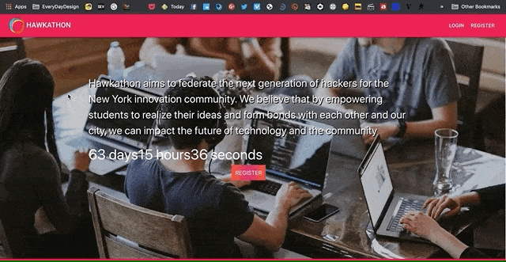
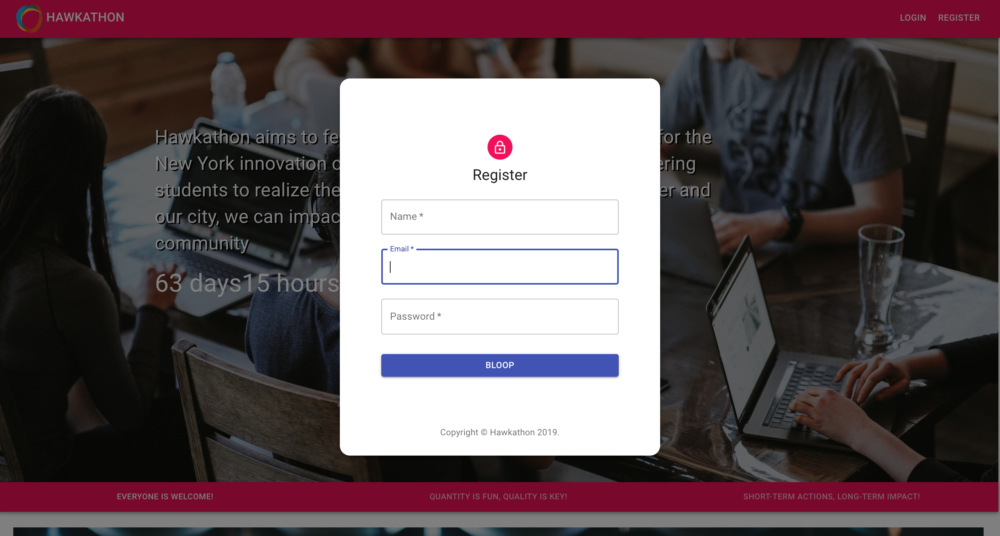
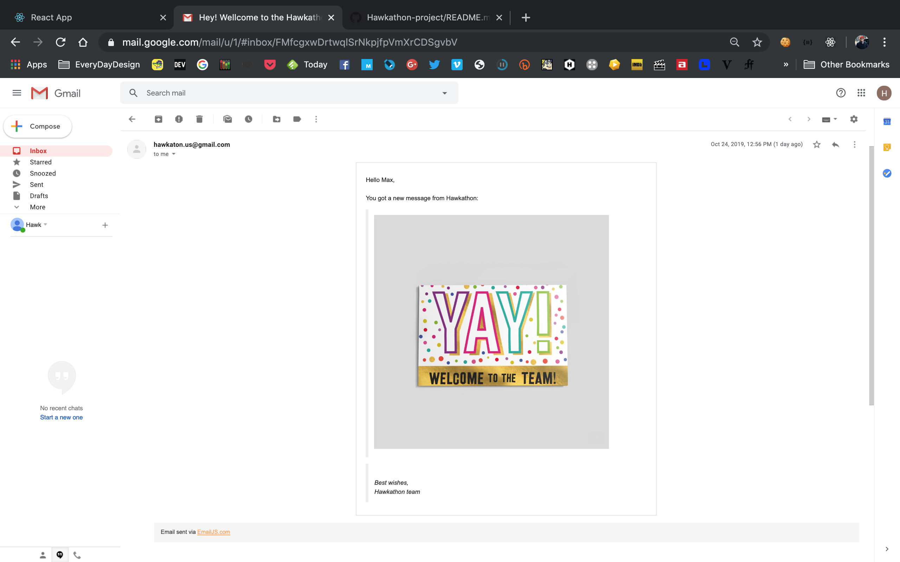
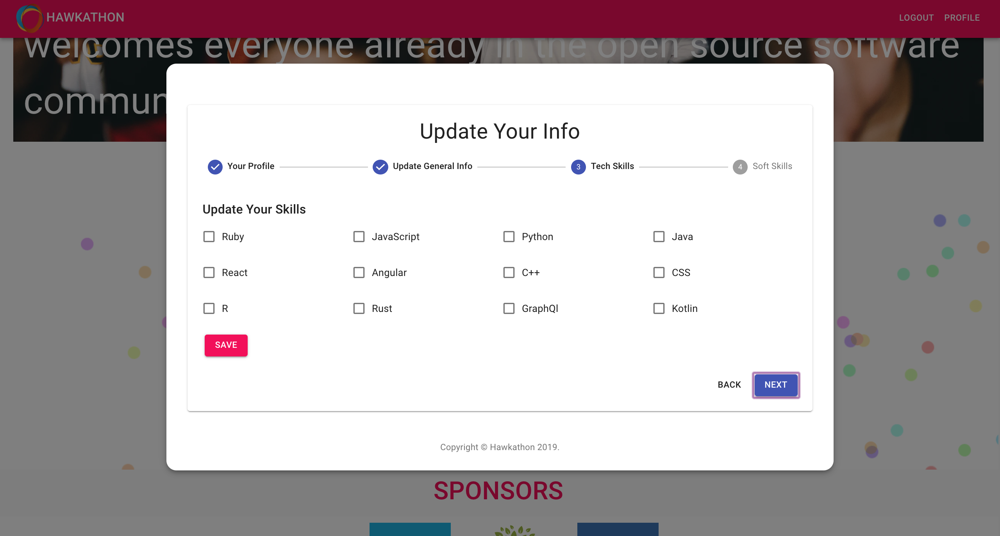
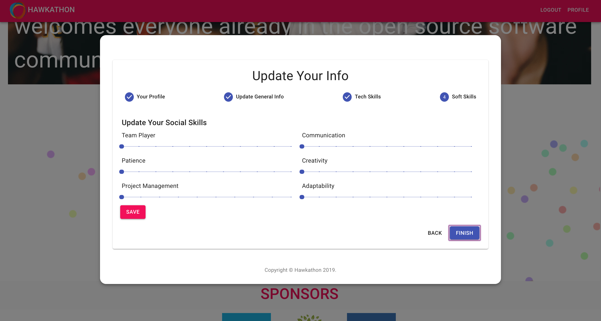
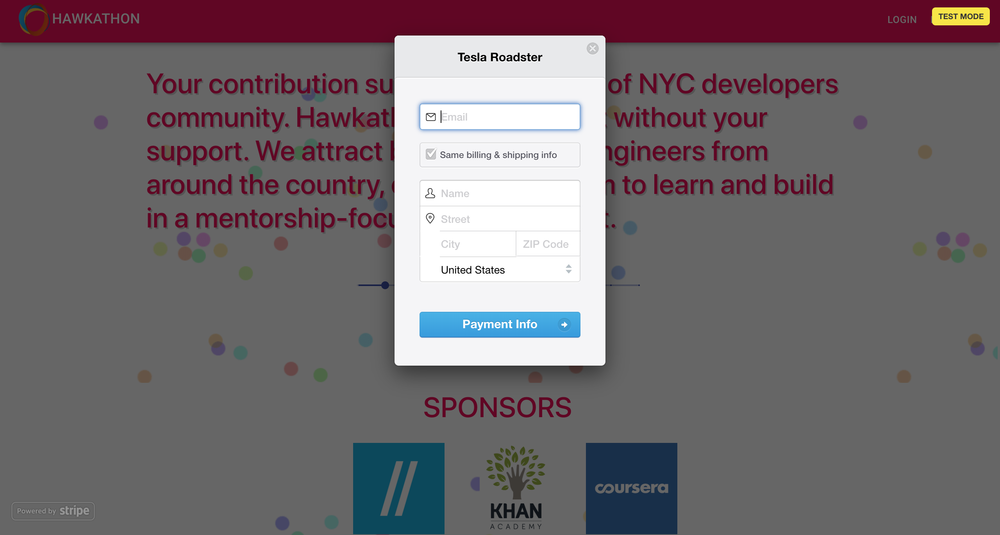

## HAWKATHON `Updated 12.13.2019` [VIDEO](https://youtu.be/9RpBgMKWtDw)

This is a single page application (SPA) that have all the functionality to advertise and run hackathon. Hawkathon visitors can register, login, see and update profile, donate. Every new registered user will receive a greeting email. As an admin of this page, you can send notifications to users. Everything ready to host and run a real-life hackathon.    

### `Goals of this project`

1. Master React skills and be proficient with Material-UI.
2. Build a fully styled single page website that ready to use and have modern UI.
3. Work with different API - donate and send emails/messages.
4. Learn Express.js framework.

### `Tech stack`

1. Front-end is built with React. First back-end is built with Rails (auth, users, content), second back-end is built with Express (donate).
2. React components styled with a [Material-UI](https://material-ui.com).
3. [EmailJS](https://www.emailjs.com/) for sending greeting mail to every new user.
4. With [Stripe](https://stripe.com/) visitors of the page can donate.

### `Run this App`

1. To run the App you need to clone this repo and another two back-ends ([Rails](https://github.com/kastergarta/hawkathon_backend_postgres), [Express](https://github.com/kastergarta/Test_ExpressJS_backend)) repos.
2. Rails app should run on http://localhost:3003 (for custom port use this -> "bundle exec puma -C config/puma.rb -b tcp://127.0.0.1:3003")
3. Rails part built on top of PostgreSQL.

### ` What you can do on the Hawkathon page?`

1. Register as a new user. 

2. Existing users log-in with a username and password. 
3. Every user can see and update his/her profile (name, email, location, password, tech skills, soft skills). 

4. Every visitor of the page can donate to the Hawkathon.

### `Thanks`

Thank you [Annie Souza](https://github.com/luanesouza), [Randy Herasme](https://github.com/randyher) and [Kevin McAlear](https://github.com/kevinmcalear) for support, professionalism, and patience. Thank you for seeing me and every student as a partner in learning and sharing. 

